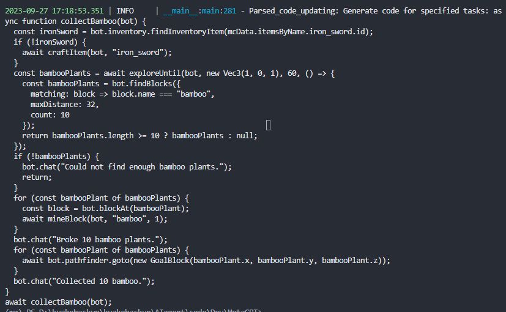

# <ins>S</ins>ee and <ins>T</ins>hink: <ins>E</ins>mbodied Agent in <ins>V</ins>irtual <ins>E</ins>nvironment

[](https://arxiv.org/abs/2311.15209)

> **See and Think: Embodied Agent in Virtual Environment**  
> Zhonghan Zhao*, Wenhao Chai*, Xuan Wang*, Li Boyi, Shengyu Hao, Shidong Cao, Tian Ye, Jenq-Neng Hwang, Gaoang Wang✉️   
> _arXiv 2023_  

[](https://www.youtube.com/embed/WGP99R5UXq0?si=i2LVxm3Mlw1F5WTZ)

STEVE, named after the protagonist of the game Minecraft, is our proposed framework aims to build an embodied agent based on the vision model and LLMs within an open world.

## :fire: News
* **[TBD]** : We will soon release our code, model weight, and dataset.
* **[2023.11.26]** :page_with_curl: We release the [paper](https://arxiv.org/abs/2311.15209).

<h3 align="center"> If you like our project, please give us a star ⭐ on GitHub for the latest update.</h3>

## 💡 Overview
The Vision Perception part takes images or videos, encodes them into tokens, and combines them with the tokens of Agent State and Task as input. The STEVE-13B in the Language Instruction part is used for automatic reasoning and task decomposition, and it calls the Skill Database in the form of the Query to output code as action.


## 📣 Demo Video
[](https://www.youtube.com/embed/NzJEqhIbcZg?si=_flZME4YDfok4LVn)
[](https://www.youtube.com/embed/OWJDZGwephs?si=Vig4h99HPsNf95CP)
[](https://www.youtube.com/embed/sloqnCtx4kc?si=eMj_bNEHlg0wg7Py)
[](https://www.youtube.com/embed/ziYueiXBP7A?si=76TWzSlHsEeC7rv1)
[](https://www.youtube.com/embed/6riHoiocb8k?si=PJC6Plb8hQQohQgI)
[](https://www.youtube.com/embed/LualEoZ7EZQ?si=xWTxrJEnZeVRedEt)

We propose STEVE, a comprehensive and visionary embodied agent in the Minecraft virtual environment. STEVE consists of three key components: vision perception, language instruction, and code action. Vision perception involves the interpretation of visual information in the environment, which is then integrated into the LLMs component with agent state and task instruction. Language instruction is responsible for iterative reasoning and decomposing complex tasks into manageable guidelines. Code action generates executable skill actions based on retrieval in skill database, enabling the agent to interact effectively within the Minecraft environment. We also collect STEVE-21K dataset, which includes 600+ vision-environment pairs, 20K knowledge question-answering pairs, and 200+ skill-code pairs. We conduct continuous block search, knowledge question and answering, and tech tree mastery to evaluate the performance. Extensive experiments show that STEVE achieves at most 1.5x faster unlocking key tech trees and 2.5x quicker in block search tasks compared to previous state-of-the-art methods.

In this repo, we provide STEVE code. This codebase is under [MIT License](LICENSE).

# Installation
STEVE requires Python ≥ 3.9 and Node.js ≥ 16.13.0. We have tested on Ubuntu 20.04, Windows 11, and macOS. You need to follow the instructions below to install STEVE.

## Python Install
```
# Clone the repository to your local machine, and install it.
git clone -b minecraft https://github.com/geekan/MetaGPT.git
cd MetaGPT-minecraft
pip install -e .
```

## Node.js Install
Ensure that NPM is installed on your system. Then install mermaid-js. (If you don't have npm in your computer, please go to the Node.js offical website to install Node.js https://nodejs.org/ and then you will have npm tool in your computer.)
In addition to the Python dependencies, you need to install the following Node.js packages:
```
npm --version
npm install -g @mermaid-js/mermaid-cli
cd metagpt/mineflayer_env/mineflayer
npm install -g npx
npm install
cd mineflayer-collectblock
npx tsc
cd ..
npm install
```
## Minecraft Instance Install

Voyager depends on Minecraft game. You need to install Minecraft game and set up a Minecraft instance.

Follow the instructions in [Minecraft Login Tutorial](installation/minecraft_instance_install.md) to set up your Minecraft Instance.

## Fabric Mods Install

You need to install fabric mods to support all the features in STEVE. Remember to use the correct Fabric version of all the mods. 

Follow the instructions in [Fabric Mods Install](installation/fabric_mods_install.md) to install the mods.

## Run
After installation，modify in minecraft_run.py
```python
mc_player.set_port(2465) # Modify this to your LAN port
```
Then run minecraft_run.py. Note that the game mode should be the survival to ensure that there's a concept of health, hungry and inventory.
```python
python minecraft_run.py
```
### Action developer

The corresponding needs to implement `GenerateActionCode` to complete the corresponding interaction with `GameEnvironment` and the information transfer of Environment.

Test Result 



### Curriculum agent

Corresponding to the need to implement `DesignTask` and `DesignCurriculum`, as well as information transfer with Environment.

## ✏️ Citation

If you find STEVE useful for your your research and applications, please cite using this BibTeX:

```bibtex
@article{zhao2023see,
  title={See and Think: Embodied Agent in Virtual Environment},
  author={Zhao, Zhonghan and Chai, Wenhao and Wang, Xuan and Boyi, Li and Hao, Shengyu and Cao, Shidong and Ye, Tian and Hwang, Jenq-Neng and Wang, Gaoang},
  journal={arXiv preprint arXiv:2311.15209},
  year={2023}
}
```
