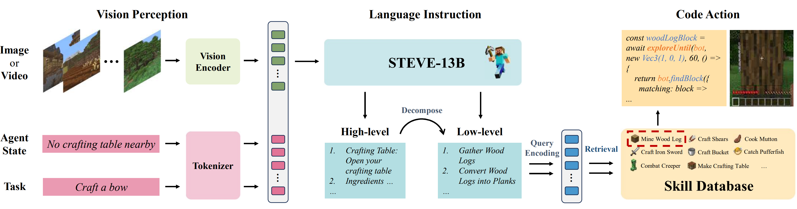

# [STEVE] <ins>S</ins>ee and <ins>T</ins>hink: <ins>E</ins>mbodied Agent in <ins>V</ins>irtual <ins>E</ins>nvironment

[](https://arxiv.org/abs/2311.15209)

> **See and Think: Embodied Agent in Virtual Environment**  
> Zhonghan Zhao<sup>♠️</sup>, Wenhao Chai<sup>♠️♥️</sup>, Xuan Wang<sup>♠️</sup>, Li Boyi, Shengyu Hao, Shidong Cao, Tian Ye, Jenq-Neng Hwang, Gaoang Wang✉️   
> _arXiv 2023._  
> <sup>♠️</sup> Equal contribution. <sup>♥️</sup> Project lead.

STEVE, named after the protagonist of the game Minecraft, is our proposed framework aims to build an embodied agent based on the vision model and LLMs within an open world.

## :fire: News
* **[TBD]** : We will soon release our code, model weight, and dataset.
* **[2023.11.26]** :page_with_curl: We release the [paper](https://arxiv.org/abs/2311.15209).

<h3 align="center"> If you like our project, please give us a star ⭐ on GitHub for the latest update.</h3>

## 💡 Overview
The Vision Perception part takes images or videos, encodes them into tokens, and combines them with the tokens of Agent State and Task as input. The STEVE-13B in the Language Instruction part is used for automatic reasoning and task decomposition, and it calls the Skill Database in the form of the Query to output code as action.


## 📣 Demo Video

## ✏️ Citation

If you find STEVE useful for your your research and applications, please cite using this BibTeX:

```bibtex
@article{zhao2023see,
  title={See and Think: Embodied Agent in Virtual Environment},
  author={Zhao, Zhonghan and Chai, Wenhao and Wang, Xuan and Boyi, Li and Hao, Shengyu and Cao, Shidong and Ye, Tian and Hwang, Jenq-Neng and Wang, Gaoang},
  journal={arXiv preprint arXiv:2311.15209},
  year={2023}
}
```
